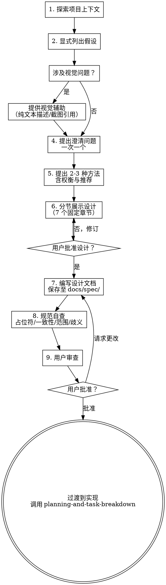

# 规范驱动开发

## 概述

在编写任何代码之前，先通过结构化对话产出经过验证的规范文档。该规范是你与人类工程师共享的唯一事实来源——它定义了我们正在构建什么、为什么构建，以及如何判断是否完成。

将经过验证的规范文档写入 `docs/spec/feature_<date>_<id>_<topic>/spec-design.md`。用户确认后，立即调用 `git add` 暂存该文件，然后执行 `git commit -m "spec: add <topic> 设计规范"` 提交。

<HARD-GATE>
在展示设计并获得用户批准之前，**不得**调用任何实现技能、编写任何代码、搭建任何项目或采取任何实现行动。这适用于**所有**项目，无论其看似多么简单。
</HARD-GATE>

## 何时使用

- 启动新项目或新功能
- 需求含糊不清或不完整
- 变更涉及多个文件或模块
- 即将做出架构决策
- 任务实现预计耗时超过 30 分钟

**不适用场景：** 单行修复、拼写纠错，或需求已明确且自包含的变更。

## 反模式：“这太简单了，不需要设计”

每个项目都要经过此流程。无论是待办事项列表、单函数工具，还是配置更改——无一例外。“简单”的项目往往因为未经审视的假设而导致最多的无效工作。设计可以很简短（对于真正简单的项目，只需几句话），但你**必须**展示它并获得批准。

## 流程图



## 规范模板

规范文档遵循 `assets/spec-template.md` 中定义的标准结构——7 个固定章节（需求背景 → 目标 → 方案设计 → 实现要点 → 验收标准 → 不做 → 待解决问题），每章必须填写完整，不得跳过。步骤 6 使用此模板分节展示设计，在填写前必须先读取模板文件。

**为隔离性和清晰度而设计：** 将系统划分为更小单元，每个都有单一明确的目的，通过定义良好的接口通信，可独立理解和测试。对每个单元回答：它做什么？如何使用它？它依赖什么？人们能否在不阅读内部实现的情况下理解它的功能？

**在现有代码库中工作：** 在提出更改之前探索当前结构，遵循现有模式。如果现有代码存在影响工作的问题（文件过大、边界不清），将这些有针对性的改进纳入设计——但不要提出无关的重构。

## 流程

你必须为以下每步创建一个任务，并按顺序完成：

### 1. 探索项目上下文

检查当前项目状态：文件、现有架构、文档、最近的提交、依赖项。这确保后续设计建立在真实基础上，而非凭空假设。

**范围评估：** 如果请求描述了多个独立的子系统（例如"构建一个包含聊天、文件存储和计费的平台"），立即标记。在细化细节之前，先帮助用户将其分解为子项目：有哪些独立部分？它们如何关联？应按什么顺序构建？每个子项目走独立的 spec → plan → build 循环。

### 2. 显式列出假设

在编写任何规范内容之前，先列出你正在采用的全部假设：

```
我所做的假设：
1. 这是一个 Web 应用（非原生移动应用）
2. 认证使用基于会话的 Cookie（非 JWT）
3. 数据库为 PostgreSQL（基于现有的 Prisma 架构）
4. 目标浏览器仅限现代浏览器（不支持 IE11）
→ 请立即纠正我，否则我将按此进行。
```

不要默默填补含糊不清的需求。规范的全部目的就是在代码编写*之前*暴露误解——而假设是最危险的误解形式。

### 3. 视觉辅助决策

判断当前问题是否涉及视觉内容（UI 布局、架构图、设计比较等）。使用测试标准：**用户通过观看是否比通过阅读能更好地理解？**

- **视觉性内容** → 提供纯文本描述、架构草图或截图引用
- **文本性内容** → 直接进入澄清问题

如果涉及视觉问题，以上述辅助为独立消息发送，不与澄清问题合并。

### 4. 提出澄清问题

逐一提出澄清问题——一条消息只提一个问题。重点关注：目标用户是谁？成功标准是什么？真正的约束是什么？以前尝试过什么？为什么是现在？

尽可能使用多项选择题，但开放式问题也可以。

**将模糊需求重构为成功标准：**

```
需求："让仪表盘变得更快"

重构后的成功标准：
- 仪表盘在 4G 连接下，LCP < 2.5s
- 首屏数据加载在 500ms 内完成
- 加载期间无布局偏移 (CLS < 0.1)
→ 这些是合适的目标吗？
```

这样你就能向清晰的目标进行求解，而非猜测"更快"到底意味着什么。

### 5. 提出 2-3 种方法

提供 2-3 种不同的方法，每种包含权衡利弊和你的推荐。优先展示推荐选项并解释原因。

评估框架：用户价值（止痛药还是维生素？）、可行性（最难的部分是什么？）、差异化（有什么真正不同的地方？）。

践行 YAGNI（You Aren't Gonna Need It）——从所有方法中移除不必要的功能。

### 6. 分节展示设计

按上方 **规范模板** 定义的 7 个固定章节分节展示设计（方案设计下按需拆分子系统章节）。每节之后询问"目前看起来是否正确？"——如果某些地方不清楚，准备好返回澄清。

### 7. 编写设计文档

将验证后的设计写入 `docs/spec/feature_<date>_<id>_<topic>/spec-design.md`，然后立即执行 `git add` 暂存该文件，随后 `git commit -m "spec: add <topic> 设计规范"` 提交。

### 8. 规范自查

**★ 使用 `Task` 工具分派独立子代理执行审查**（参照 `assets/spec-reviewer-prompt.md` 模板）。子代理以全新视角执行三层校验（L1 结构完整性 / L2 需求一致性 / L3 边界鲁棒性），产出结构化审查报告。作者不得自查——独立审查才能发现盲点。

审查报告返回后：
- **✓ 可以继续** → 内联修复报告中的建议项，进入步骤 9
- **✗ 严重问题** → 修复规范后重新分派子代理审查，通过后再进入步骤 9

### 9. 用户审查 → 过渡到实现

在规范自查通过后，请用户在继续之前审查书面规范：

> "规格说明已撰写并提交至 `docs/spec/feature_<date>_<id>_<topic>/spec-design.md`。独立审查已通过，审查报告如下：<简要摘要>。请审查，并在我们开始制定实现计划之前告诉我是否需要进行任何更改。"

等待用户的回复。如果他们请求更改，进行修改并重新运行规范自查（步骤 8）。仅在用户批准后继续。

**批准的下一步：** 执行命令 `/plan` 创建详细的实现计划和任务清单。**不要**直接跳到编写代码。

## 设计之后：保持规范生命力

规范是一份活文档，而非一次性产物：

- **当决策变更时，更新规范文档** —— 如果发现数据模型需要更改，先更新规范，再实施。
- **当范围变更时，更新规范文档** —— 新增或削减的功能应反映到规范中。
- **提交规范文件** —— 规范应与代码一起纳入版本控制。
- **在 PR 中引用规范** —— 关联到每个 PR 所实现的规范章节。

## 常见借口

| 借口                         | 现实                                                                                                                                                       |
| ---------------------------- | ---------------------------------------------------------------------------------------------------------------------------------------------------------- |
| "这太简单了，不需要规范"     | 简单的任务不需要*冗长*的规范，但仍然需要验收标准。两行字的规范也是可以的。每个项目都要经过此流程——"简单"的项目往往因为未经审视的假设而导致最多的无效工作。 |
| "我先写完代码再补规范"       | 那是文档，不是规范。规范的价值在于*编码前*强制澄清问题。事后写规范会丢失所有发现过程。                                                                     |
| "写规范会拖慢进度"           | 15 分钟写规范能避免数小时的返工。15 分钟的瀑布式梳理远胜于 15 小时的调试。                                                                                 |
| "反正需求总是会变的"         | 正因为如此，规范才必须是活文档。一份过时的规范也强过没有规范——它记录了变更历史。                                                                           |
| "用户清楚自己想要什么"       | 即使是清晰的请求也带有隐含假设。用户描述的是解决方案，而非问题——规范的目的就是回到问题本身。                                                               |
| "我知道架构，不需要展示设计" | 规范是给审查者的共享事实来源。如果你不写下来，别人就无法有效地验证、审查或挑战你的设计。                                                                   |

## 危险信号

- 在没有任何书面需求的情况下开始编写代码
- 在厘清"完成"的定义之前就询问"我是不是应该直接开始构建？"
- 实施规范中未提及的功能
- 做出架构决策而不记录在案
- 因为"要构建什么显而易见"而跳过规范制定
- 跳过假设列出步骤——默默填补了需求空白
- 产出设计后跳过自查——留下"TBD"或矛盾的需求进入实现阶段
- 未经用户审查批准就直接进入实现
- 一次性提出多个问题，让用户不知所措

## 验证

在进入实现阶段之前，请确认：

- [ ] 已探索项目上下文（步骤 1）
- [ ] 假设已显式列出并获得纠正（步骤 2）
- [ ] 已逐一提出澄清问题，成功标准已量化（步骤 4）
- [ ] 已探索 2-3 种方法并说明推荐理由（步骤 5）
- [ ] 设计已分节展示，覆盖全部 7 个固定章节 + 按需子系统拆分（步骤 6）
- [ ] 规范自查通过——无占位符、无矛盾、无歧义、范围聚焦（步骤 8）
- [ ] 用户已审查并批准了规范文档（步骤 9）
- [ ] 设计规范文档已保存到 `docs/spec/feature_<date>_<id>_<topic>/spec-design.md`，已 `git add` + `git commit -m "spec: add <topic> 设计规范"` 提交（步骤 7）
